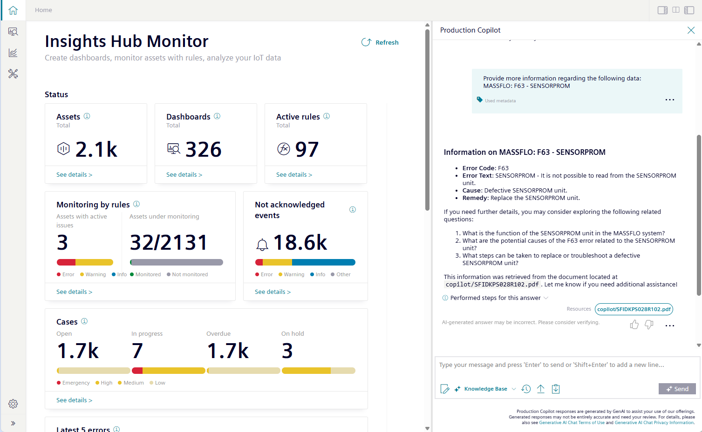

# Insights Hub Production Copilot

Insights Hub Production Copilot is an AI-powered assistant seamlessly integrated into Insights Hub Monitor and other applications.

You can find more about this in the [product documentation](https://documentation.mindsphere.io/MindSphere/apps/production-copilot/production-copilot.html).

## About

This repository provides some information / product examples or an `early access` tutorial.

- [Application Example: "MS Teams"](./teams-example/README.md) 
Using Insights Hub Production Copilot in Microsoft Teams.
- [Tutorial for Early Access Phase)](./tutorial/) 
This was required for an early access phase - in the meantime you can handle everything in `Insights Hub Copilot Studio`.

## Prerequisites

These examples are only available and working for customers with an Insights Hub subscription including the Insights Hub Production Copilot.

## Questions

If you have any questions, your sales representative, customer success manager, or our customer support team is here for you.
