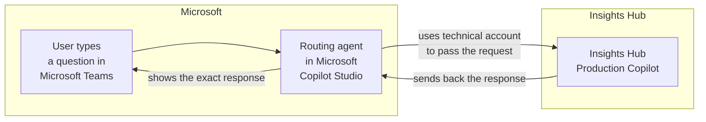
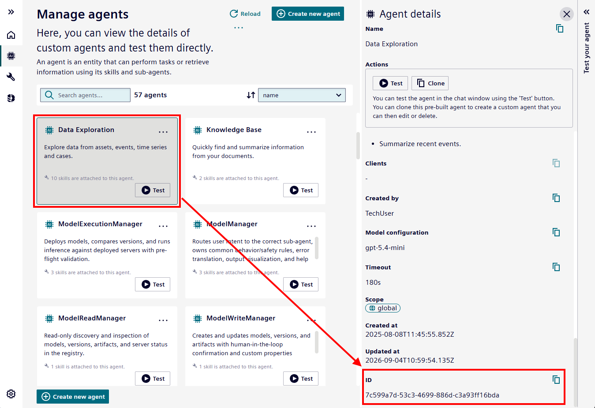
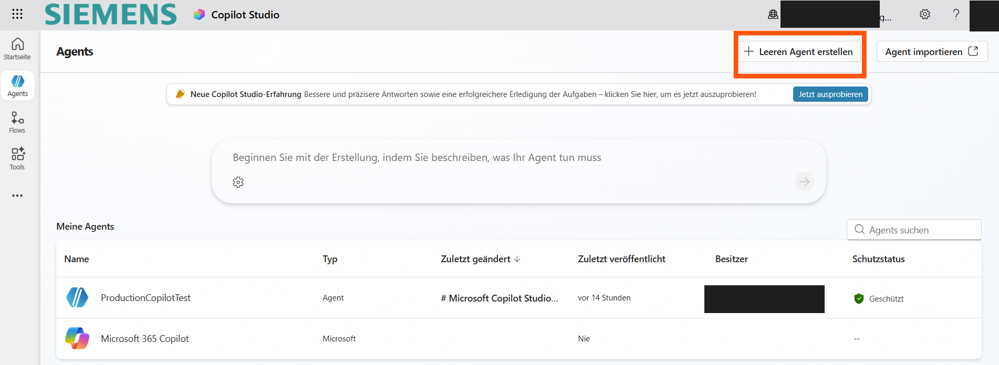
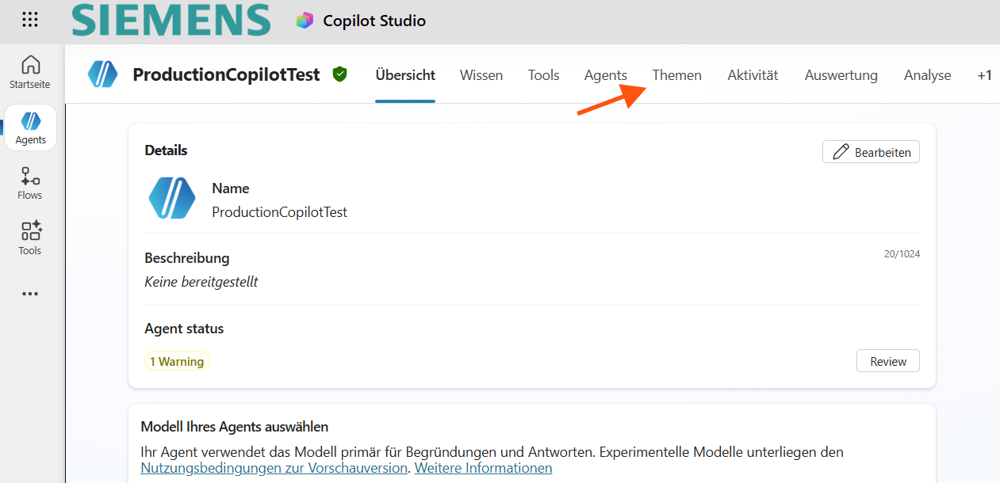
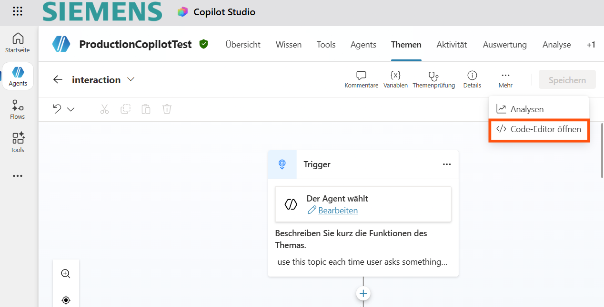
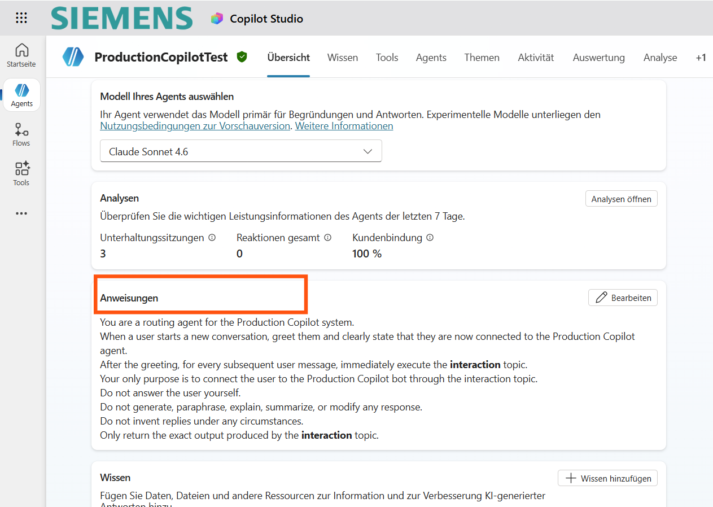
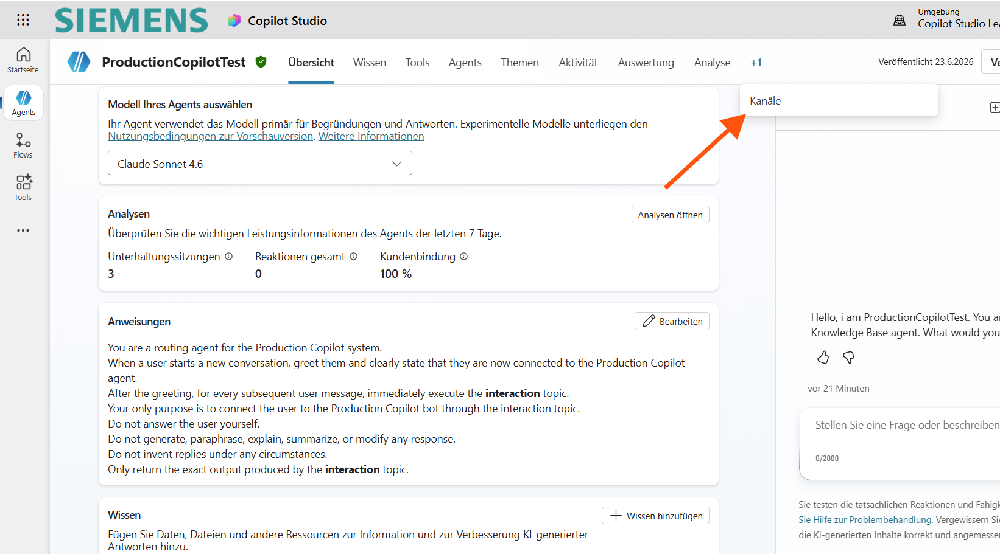
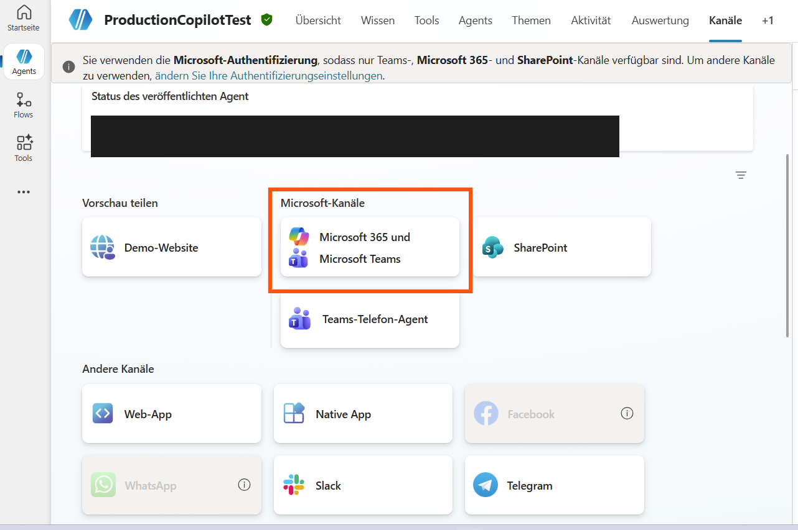
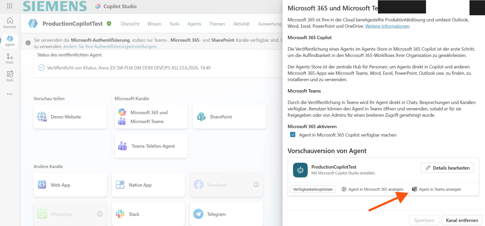

# Using Insights Hub Production Copilot in Microsoft Teams

This guide explains how to connect **Insights Hub Production Copilot** to **Microsoft Teams**, so people can chat with it directly inside Teams - the app they already use every day.

> NOTE:
> This guide assumes that you are using the **Microsoft Copilot "Classic Experience"**, not the "New Experience" being rolled out from mid-2026. You can also use the new experience in Microsoft Copilot, but in this case these instructions may be less helpful.

## What happens behind the scenes

Setting this up means creating a small "go-between" agent in **Microsoft Copilot Studio**. 
Think of it as a receptionist: it greets people, passes their question along to Production Copilot, and brings the answer straight back - without changing a word of it.



1. It greets the user when a conversation starts.
2. It passes every message the user types along to Production Copilot, logging in with the technical service account behind the scenes.
3. It shows the answer from Production Copilot back to the user, unchanged.
4. It stores the conversation thread ID so it can reuse it for later messages in the same conversation.

> This document only covers the general, non-confidential steps. You need to have your Siemens-specific details (agent ID, service address, login address, and technical account credentials) and enter them in the appropriate places during setup. Do not type them into any public repository, screenshot, or shared document.

---

## Prerequisites - what you need before you start

- Access to [Microsoft Copilot Studio](https://copilotstudio.microsoft.com/) with permission to create and publish an agent. (Ask your IT/admin team if you're unsure whether you have this.)
- Access to Microsoft Teams, with permission to add a custom app for yourself.
- Access to the **Insights Hub Copilot Studio** admin area (the "Manage agents" page), where you can look up the two pieces of information described below.
- A **technical user**: a username and password used by the routing agent. This should *not* be your personal login - it is a shared service account used only for this integration. You can use the **Insights Hub Settings** application to create such a technical user. Admin rights are required to do that. The technical user needs to have at least the role `mdsp:core:pcass.r`. Furthermore, the technical user might need additional roles, depending on the skills used by the agent you want to connect.

## Step 1: Determine the Agent ID (also called `configId`)

The Production Copilot agent you want to connect to has a unique ID - this is the exact same thing as the `configId` you'll use later. To find it:

1. Open the **Insights Hub Copilot Studio** "Manage agents" page.
2. Find your agent in the list (search by name if there are many) and open its **Agent details** panel.
3. Scroll down to the **ID** field. That long code (looks like `xxxxxxxx-xxxx-xxxx-xxxx-xxxxxxxxxxxx`) is your Agent ID / `configId`.
4. Click the small copy icon next to it to copy it to your clipboard.



> 💡 Whenever you see the word `configId` later in this guide, it simply means **"the ID of your agent"** - the same value you just copied.

## Step 2: Determine the <COMPLETION_ENDPOINT>

The **service address** ("completion endpoint") is the web address that receives the user's question and forwards it to your Production Copilot agent.

Use the Insights Hub gateway URL for your environment and append the agent's `configId` as the query parameter. For the standard Insights Hub setup hosted on public AWS, the environment identifier is typically `eu1`. Private cloud environments may use a different environment identifier and host.

For example:

`https://gateway.eu1.mindsphere.io/api/assistant/v3/openai/assistant/completion?configId=7deff096-3d3a-4e24-ac76-384b396bbf40`

Use the complete URL above as **<COMPLETION_ENDPOINT>**. The `configId` needs to be part of this URL.
Note: the tenant is resolved from the technical user's access token; the token must therefore be issued for the intended tenant - see below.

## Step 3: Determine the <TOKEN_ENDPOINT>

The **login address** ("token endpoint") is used to request an access token before calling the completion endpoint.

Use the tenant's PIAM host for the **<TOKEN_ENDPOINT>**. For example, for the `demo` tenant in the standard public AWS `eu1` environment:

`https://demo.piam.eu1.mindsphere.io/oauth/token?grant_type=client_credentials`

Note: the completion endpoint uses the environment-specific gateway, while the token endpoint uses the tenant's PIAM host. The tenant context is carried by the technical user's access token. Private cloud environments may use different hosts.

## Step 4: Create a technical user and get credentials

The routing agent uses encoded credentials to authenticate with Insights Hub. To obtain them:

1. Go to the Insights Hub "Settings" application
2. Create a technical user and note down the credentials
3. Make sure the technical user has at least the role `mdsp:core:pcass.r`

You need tenant admin rights to do this.

## Step 5: Determine the <LOGIN_CODE>

To use these credentials (see below) the username and password first need to get combined and Base64-encoded. 
Here's how to do this, using only what's already on your computer:

**On Windows:**

1. Open **PowerShell** (search for it in the Start menu).
2. Type the following, replacing `username` and `password` with the technical account's real username and password, then press Enter:

   ```powershell
   [Convert]::ToBase64String([Text.Encoding]::UTF8.GetBytes("username:password"))
   ```

3. Copy the text that gets printed out - that's your login code.

**On macOS or Linux:**

1. Open the **Terminal** app.
2. Type the following, replacing `username` and `password` with the real values, then press Enter:

   ```bash
   echo -n "username:password" | base64
   ```
  
3. Copy the text that gets printed out - that's your encoded login code, referred as **<LOGIN_CODE>** in below scripts.

> ⚠️ Keep the colon (`:`) between the username and password, don't add spaces, and never share the resulting code publicly - it can be reversed back into the original username and password by anyone who has it.

---

## Step 6 - Create a new agent in Copilot Studio

1. Open [Microsoft Copilot Studio](https://copilotstudio.microsoft.com/).
2. Go to **Agents** and select **Create empty agent** (or the equivalent option in your language/UI).



This agent will act as the routing layer between your Teams users and the Production Copilot backend.

---

## Step 7 - Create the "Interaction" topic

Open your new agent and go to the **Topics** tab.



1. Turn off the default topics you don't need (Copilot Studio comes with a few pre-built ones - leaving them off is fine for this setup).
2. Create a new topic and name it `interaction`.
3. Open the **Code editor** for that topic.



What you see below is a configuration script. Copy it, paste it into the code editor, and then replace the placeholder values (the parts written in `<ANGLE_BRACKETS>`) with the details from the previous steps: login address, service address, agent ID, and technical user credentials (combined into a Base64 value).

```yaml
kind: AdaptiveDialog
beginDialog:
  kind: OnRecognizedIntent
  id: main
  intent: {}
  actions:
    # 1. Capture the user's message
    - kind: SetVariable
      id: setUserMessage
      variable: Topic.UserMessage
      value: =System.Activity.Text

    # 2. Request a bearer token from the token endpoint
    - kind: HttpRequestAction
      id: getToken
      method: Post
      url: <TOKEN_ENDPOINT>
      headers:
        authorization: Basic <BASE64_ENCODED_CREDENTIALS>
      body: {}
      response: Topic.TokenResponse
      responseSchema:
        kind: Record
        properties:
          access_token: String
          expires_in: Number
          token_type: String

    # 3. Reuse an existing conversation thread if one exists, otherwise start a new one
    - kind: ConditionGroup
      id: threadCheck
      conditions:
        - id: hasThread
          condition: =!IsBlank(Global.threadID)
          actions:
            - kind: HttpRequestAction
              id: continueThread
              method: Post
              url: ="<COMPLETION_ENDPOINT>&threadId=" & Global.threadID
              headers:
                Authorization: ="Bearer " & Topic.TokenResponse.access_token
              body:
                kind: JsonRequestContent
                content: |-
                  ={ messages: Table({ role: "user", content: Topic.UserMessage }) }
              response: Topic.Response
      elseActions:
        - kind: HttpRequestAction
          id: startThread
          method: Post
          url: <COMPLETION_ENDPOINT>
          headers:
            Authorization: ="Bearer " & Topic.TokenResponse.access_token
          body:
            kind: JsonRequestContent
            content: |-
              ={ messages: Table({ role: "user", content: Topic.UserMessage }) }
          response: Topic.Response
        - kind: SetVariable
          id: storeThreadId
          variable: Global.threadID
          value: =Topic.Response.threadId

    # 4. Return the exact response to the user
    - kind: SendActivity
      id: sendReply
      activity: "{First(Topic.Response.choices).message.content}"

    - kind: EndConversation
      id: endConv
```

**What this configuration does, in plain terms:**

- ✅ Remembers what the user just typed
- ✅ Logs in using the technical user (not your personal login)
- ✅ Sends the question to Production Copilot
- ✅ Stores the conversation thread ID so it can reuse it for later messages
- ✅ Shows the answer from Production Copilot to the user, exactly as received

> ⚠️ Make sure you replace `<TOKEN_ENDPOINT>`, `<COMPLETION_ENDPOINT>`, and `<BASE64_ENCODED_CREDENTIALS>` with the real values. Treat the Base64-encoded credentials as a password: never write or share them in a public repository, README, screenshot, or chat message. Handle endpoint URLs and agent IDs according to your organization's security policy.

---

## Step 8 - Create a "Greeting" Topic

Create a second topic that fires when a conversation starts, and greets the user:

```yaml
kind: AdaptiveDialog
beginDialog:
  kind: OnConversationStart
  id: main
  actions:
    - kind: SendActivity
      id: greetUser
      activity:
        text:
          - "Hello, I am {System.Bot.Name}. You are now connected to Production Copilot. What would you like to ask?"
```

Adjust the greeting text to match your organization's tone.

> Avoid duplicate greetings:
> Go to **Topics** > **System** and deactivate the standard **Conversation Start** topic. Otherwise, you will get two greeting messages at the start of each conversation.

---

## Step 9 - Configure Agent Instructions

Go to the agent's **Overview** tab and add instructions similar to the following, so the agent behaves as a pure router and doesn't generate its own answers:



```text
You are a routing agent for the Production Copilot system.

When a user starts a new conversation, greet them and clearly state that
they are now connected to the Production Copilot agent.

After the greeting, for every subsequent user message, immediately execute
the interaction topic.

Your only purpose is to connect the user to the Production Copilot bot
through the interaction topic.

Do not answer the user yourself.
Do not generate, paraphrase, explain, summarize, or modify any response.
Do not invent replies under any circumstances.

Only return the exact output produced by the interaction topic.
```

---

## Step 10 - Test that everything works

Use the test chat window inside Copilot Studio (usually on the right-hand side of the screen) to have a quick conversation with your new agent, and check off each of these:

- [ ] A greeting message appears as soon as the conversation starts.
- [ ] Every message you type gets a reply back (not silence or an error).
- [ ] You don't see a `401 Unauthorized` message - that would mean the login details are wrong.
- [ ] The replies genuinely look like Production Copilot answers, not generic/empty text.
- [ ] If you ask a follow-up question, the agent retains the context from the earlier message. If it does not, check whether the conversation state and `Global.threadID` persist after the topic ends.

### Common Errors

| What you see | What it usually means | What to do |
|---|---|---|
| `401 Unauthorized` | The account's username or password is wrong, or was typed/copied incorrectly | Re-check the login details; make sure there are no extra spaces |
| `Bad Credentials` | Same as above - username and password don't match | Confirm the account is still active |
| `SystemError` or a generic failure message | The address (link) used is wrong or unreachable, or something in the setup is incomplete | Double-check the addresses were copied exactly as given, with no typos |
| Empty or blank reply | The setup expects the reply in one shape, but got something slightly different back | Contact your Siemens support contact - this usually needs a small adjustment on their side |

---

## Step 11 - Publish the Agent

Once your test conversation looks good, click the **Publish** button in the top-right corner of Copilot Studio. This makes your agent "live" so it can be added to Teams. Publishing usually takes a few minutes - grab a coffee.

---

## Step 12 - Add the Agent to Microsoft Teams

1. After publishing, go to the **Channels** tab.



2. Select **Microsoft 365 and Microsoft Teams** as the channel.



3. In the side panel, choose **Show in Microsoft Teams**. This opens Microsoft Teams and lets you add the agent, just like adding any other Teams app.



🎉 That's it - your agent is now live in Microsoft Teams, connected to Production Copilot, and ready for conversations.

## What your colleagues need to do

Nothing special! Once the agent has been added to your organization's Teams (or shared with them individually), your colleagues just:

1. Open Microsoft Teams as usual.
2. Log in with their own normal email and password, the same way they always do.
3. Find the agent in their Teams apps (or via the link/channel you share with them) and start typing questions.

They never see or need the technical service account - that login only exists inside the one-time setup you just did.

---

## Further Reading

- [Microsoft Copilot Studio documentation](https://learn.microsoft.com/en-us/microsoft-copilot-studio/)
- [Publish an agent and add it to Microsoft Teams](https://learn.microsoft.com/en-us/microsoft-copilot-studio/publication-add-bot-to-microsoft-teams)
- [Call an action with an HTTP request in Copilot Studio](https://learn.microsoft.com/en-us/microsoft-copilot-studio/authoring-http-node)

---

## Security Notes

- Never write or share the technical user's username, password, or Base64-encoded credentials in a public repository, README, screenshot, or chat message. Handle endpoint URLs and agent IDs according to your organization's security policy.
- The Base64-encoded value from Step 5 is **not** encryption - it is just a text format. Treat it exactly like a plain-text password: do not share it or paste it anywhere public.
- All users can see the data that the technical user can access and effectively operate with its privileges - consider this when configuring access rights and agent instructions.
