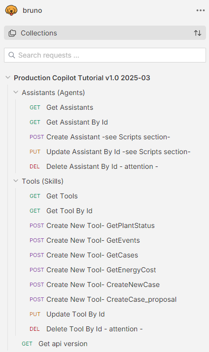
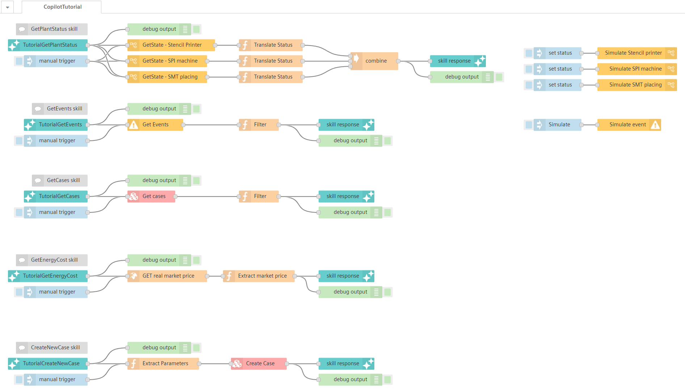

# Production Copilot - Early Access

In the `early access` phase developers can test some upcoming features in an early stage / beta version using a tutorial.

The mentioned bruno collection or vfc sample flows are uploaded here:

- [Tutorial Bruno Collection](./bruno/Production%20Copilot%20Tutorial%20v1.0%202025-03.json) 
    
- [Tutorial VFC Flow](./vfc/Production-Copilot-Tutorial.vfc-sample-flow.json) 
    